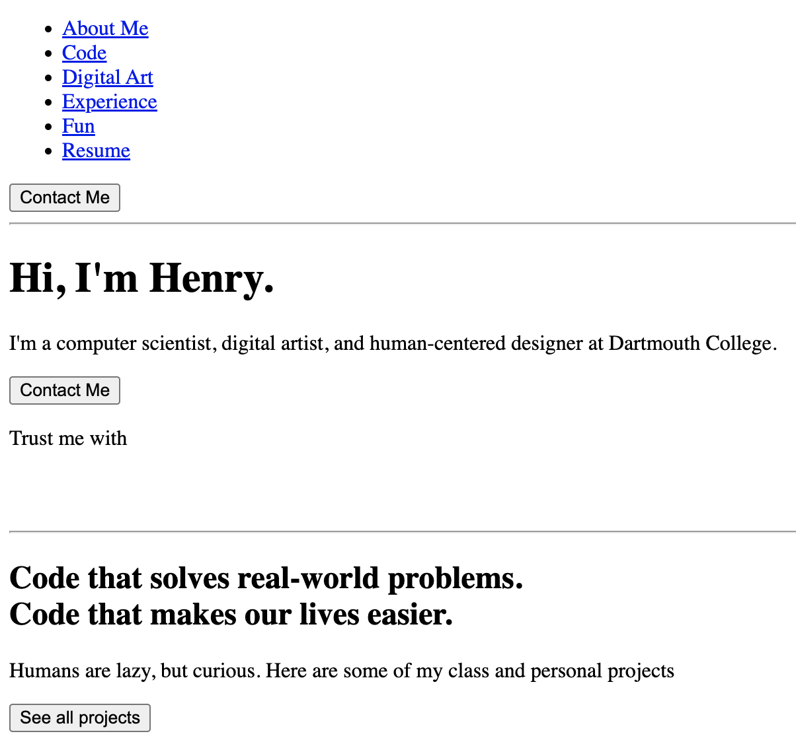
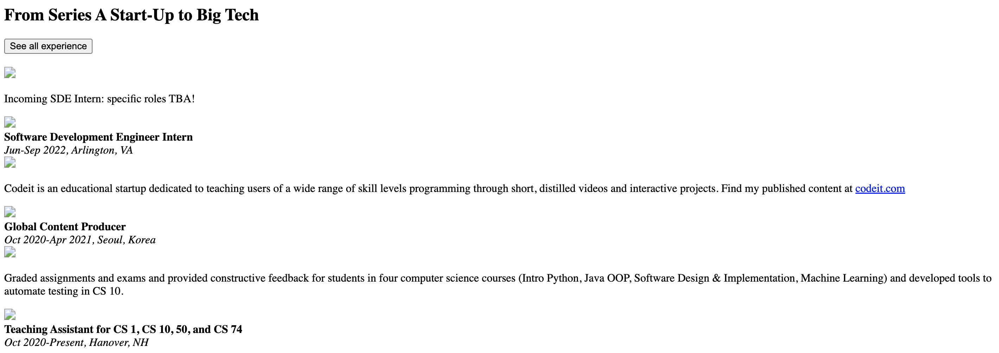
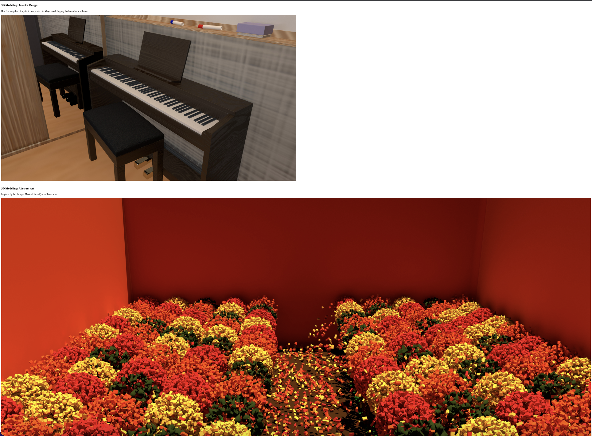
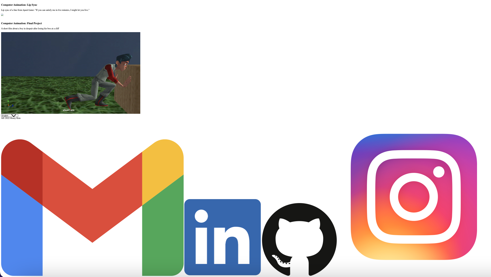

# Henry Kim
# Lab 1

*For Lab 1, I created a personal page inspired by [notion.so].(https://notion.so) I've simplified some parts and rearranged the order of the sections to better fit the logic of my site.* 

[https://henrykim-lab1.netlify.app/](https://henrykim-lab1.netlify.app/)

## What Worked Well
I was able to add a good amount of content from my past works, including GIFs of demos and animations. I also added a lot of CSS hover states, particularly enlargening sections when they are hovered over.

## What Didn't
I had hoped to create a carousel for the code samples to more closely mimick the site, but I didn't have enough time to include it. Otherwise, I copied/adapted multiple subsections from the site.

## Extra Credit
Checkbox hack for mobile responsive mode used at the top menu

## Screenshots of HTML Skeleton

